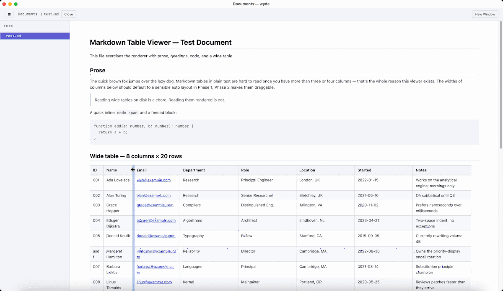

<p align="center">
  
</p>

<p align="center">
  A native macOS markdown viewer for wide tables.
</p>

<p align="center">
  
</p>

Real `<table>` elements with draggable column dividers and inline cell
editing. Edits write back surgically — only the changed cell touches
disk; the rest of the file stays byte-identical so `git diff` and
external tools see no churn.

## Why I built this

In my current job, we are all-in AI, and we've been working a lot with
Andrej Karpathy's idea of LLM-managed knowledge base. As a result, we
have a lot of AI-generated files in markdown — schema definitions, ETL
mappings, comparison matrices, decision logs — and the moment a table
gets more than four or five columns, every markdown editor I've tried
becomes painful to use. Obsidian, Typora, VS Code, Mark Text — they
all treat tables like punishment.

The fundamental problem is that markdown's plain-text format has **no
concept of column width**. Editors deal with this in one of two
unhappy ways:

- _Ignore it._ The table renders with all columns squashed together;
  long content wraps awkwardly or gets cut off; you can't read what's
  in front of you.
- _Pad the source with whitespace_ to "fix" rendering. This produces
  noisy diffs, fights every other tool that touches the same file
  (Claude Code in particular keeps re-padding tables out from under
  you), and makes `git blame` useless.

wyde takes a third path: **column width is purely a session-only
display concern.** Drag a column wider, read your table comfortably,
close the file. The `.md` on disk never gets touched. Next time you
open it, columns reset to a sensible default — and the file stays pure
markdown that every other tool can read without surprise.

You also get **inline editing for cells, paragraphs, ATX headings, and
list items**. Click a cell or double-click a paragraph, type, blur to
save. The diff on disk shows only the edited block; everything else
stays byte-identical.

## Current limitations

- **macOS only.** Distributed as an unsigned `.app`, so Gatekeeper
  warns on first launch — see Install below for the right-click → Open
  workaround.
- **Read-only blocks.** Code blocks, blockquotes, horizontal rules,
  setext-style headings (`Title\n=====`), HTML blocks, and YAML
  frontmatter aren't editable inside the app. Edit them in your normal
  editor; the file watcher refreshes the view automatically.
- **GFM tables only.** No support for alignment beyond what GFM offers.
- **Column widths reset** on every file open. This is intentional — see
  above — but if it bites you, that's the trade-off you're choosing.
- **One folder per window** (Obsidian-style). No multi-folder view
  inside a single window; ⌘N opens a new window for a different
  folder.
- **No code signing or auto-update.** Casual-share distribution; if you
  want notarization or in-app updates, that's a separate setup.
- **No prose WYSIWYG.** Editing prose means editing raw markdown source
  (so `**bold**` shows up in the textarea). If you'd rather see
  formatted text while editing, this isn't the tool.

---

## Install

Grab `wyde_*_universal.dmg` from the latest
[release](https://github.com/bernshawtsui/wyde/releases). One `.dmg`
works on Apple Silicon and Intel Macs.

1. Open the `.dmg` and drag **wyde** into `/Applications`.
2. Double-click **wyde** to launch. macOS will block it with
   "wyde cannot be opened because Apple cannot check it for malicious
   software" — this is expected (the build is unsigned, no Apple
   Developer certificate). Click **Done**.
3. Open **System Settings → Privacy & Security**, scroll down to
   the **Security** section, and click **Open Anyway** next to the
   message about wyde.
4. Try double-clicking wyde again. macOS will show a final
   confirmation dialog — click **Open**.

After this first launch the warning never reappears; subsequent
launches are normal double-clicks from the dock or Spotlight.

> **Power-user alternative** (skip the Settings round-trip): run
> `xattr -dr com.apple.quarantine /Applications/wyde.app` in Terminal
> once after copying the app. Same effect, no Gatekeeper dialog.

> **Why the extra steps?** On macOS 15 Sequoia and later, Apple
> removed the old "right-click → Open" shortcut for unsigned apps —
> the System Settings detour is the new official path for any app
> not signed with a paid Apple Developer ID.

## Features

### Wide tables
Real `<table>` elements with draggable column dividers. Drag a column
edge to widen it; column widths are remembered for the duration of the
session but never written to disk.

### Inline editing
- **Cells** — click once to edit.
- **Paragraphs, list items, ATX headings (`# … ######`)** — double-click
  to edit the raw markdown for that block.
- **Enter** (or blur) saves; **Esc** cancels. In multiline blocks
  (paragraphs, list items), **Enter** inserts a newline and **⌘Enter**
  saves.
- Edits write back surgically — only the changed block is rewritten,
  so `git diff` stays clean.

### Tabs and split-screen
- Click a file in the sidebar to open it in a tab.
- Drag a tab to the **left** or **right** side of the window to open a
  second pane side-by-side. Drag a tab onto the other pane's tab bar
  to move it back.
- Each pane has its own active tab, scroll position, and find-bar.

### Find in document (⌘F)
- Opens a per-pane search bar at the top of the focused pane.
- All matches highlight yellow; the active match highlights orange and
  scrolls into view.
- Case-insensitive. **Enter** / **↓** = next, **Shift+Enter** / **↑** =
  previous, **Esc** closes the bar.

### Mermaid diagrams
- Fenced ` ```mermaid ` blocks render as SVG with a toolbar for
  **zoom in / out / fit / reset**.
- **⌘-scroll** (or **Ctrl-scroll**) over a diagram zooms; drag to pan.

### Frontmatter properties panel
YAML frontmatter is parsed and shown above the document as a
key/value panel; the raw frontmatter stays in the file untouched.

### Live file watcher
External edits to the open file refresh the view automatically
(deferred while you're mid-edit in a cell or block, then applied as
soon as you finish).

---

## Keyboard shortcuts

### Folder & window
| Shortcut | Action |
| --- | --- |
| **⌘O** | Open folder |
| **⌘N** | New empty window |
| **⌘B** | Toggle sidebar |
| **⌘R** | Reload the active file from disk |

### Tabs
| Shortcut | Action |
| --- | --- |
| **⌘W** | Close the active tab in the focused pane |
| **⌘⇧]** | Next tab |
| **⌘⇧[** | Previous tab |
| _drag tab to side_ | Open a split-screen pane |

### Find in document
| Shortcut | Action |
| --- | --- |
| **⌘F** | Open the find bar in the focused pane (or re-focus it) |
| **Enter** / **↓** | Next match |
| **⇧Enter** / **↑** | Previous match |
| **Esc** | Close the find bar |

### Zoom
| Shortcut | Action |
| --- | --- |
| **⌘+** / **⌘=** | Zoom in |
| **⌘-** | Zoom out |
| **⌘0** | Reset zoom |

### Editing
| Shortcut | Action |
| --- | --- |
| _click cell_ | Edit a table cell |
| _double-click block_ | Edit a paragraph, list item, or ATX heading |
| **Enter** | Save (or insert newline in multiline blocks) |
| **⌘Enter** | Save (multiline blocks only) |
| **Esc** | Cancel the edit |

### Other
| Shortcut | Action |
| --- | --- |
| **⌘+click** a link | Open the link in your default browser |
| **⌘-scroll** over a diagram | Zoom Mermaid diagram |

---

## Building from source

If you want to compile wyde yourself (Mac toolchain required), see
[DEVELOPING.md](./DEVELOPING.md).

Maintainer release procedure lives in [RELEASING.md](./RELEASING.md).
